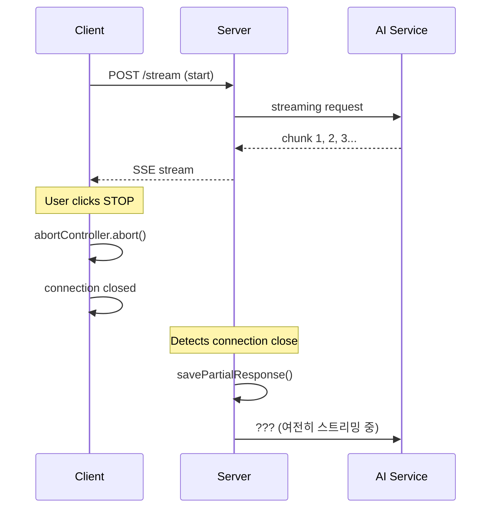

# 스트리밍 중단(Abort) 처리 시스템 개선 계획

## 📊 Slide 1: 현재 시스템 Abort 처리 현황 분석

### 🔍 **현재 구현 상태**

#### ✅ **잘 구현된 부분**

- **클라이언트 측**: XState 기반의 체계적인 상태 관리

    - `simpleStreamingMachine.ts`: ABORT → aborted (final state)
    - 여러 레벨의 중단 처리 (네비게이션, 사용자 액션, 에러)
    - 부분 콘텐츠 보존 기능

- **Node.js 서버**: 포괄적인 중단 감지
    ```javascript
    request.raw.on('close', () => savePartialResponse());
    request.raw.on('error', () => savePartialResponse());
    ```

#### ❌ **문제점**

- **Supabase Edge Function**: 중단 처리 로직 부재
- **서버 알림 부족**: 클라이언트가 의도적으로 중단할 때 서버에 알려주지 않음
- **일관성 부족**: 서버 구현체마다 다른 중단 처리 방식

### 🤔 **토론 포인트 1**

> **질문**: 현재 시스템에서 사용자가 "Stop" 버튼을 누르면 어떤 일이 일어날까요? 서버는 언제 알게 될까요?

### 📝 **과제 1**

팀원별로 다음 시나리오를 분석해보세요:

- **A팀**: 네트워크가 끊어졌을 때 vs 사용자가 Stop을 눌렀을 때의 차이점
- **B팀**: 서버 로그를 보고 클라이언트 중단을 어떻게 감지할 수 있는지 조사

---

## 📊 Slide 2: 서버-클라이언트 Abort 통신 문제 분석

### 🔗 **현재 통신 흐름**



### 🚨 **핵심 문제들**

1. **AI 서비스 리소스 낭비**

    - 클라이언트가 중단해도 AI는 계속 토큰 생성
    - OpenAI/Claude API 비용 계속 발생

2. **서버 상태 불일치**

    - 클라이언트: "중단됨"
    - 서버: "아직 스트리밍 중"
    - AI 서비스: "계속 생성 중"

3. **사용자 경험 문제**
    - "중단했는데 왜 아직 로딩 중이지?"
    - 실제 중단까지 지연 시간

### 🤔 **토론 포인트 2**

> **질문**: ChatGPT에서 Stop을 누르면 즉시 멈추는 것처럼 보입니다. 이들은 어떻게 구현했을 것 같나요?

### 📝 **과제 2**

- **C팀**: ChatGPT, Claude.ai 등에서 Stop 버튼 테스트하고 UX 패턴 분석
- **D팀**: 실제 네트워크 탭에서 중단 시 어떤 요청들이 발생하는지 확인

---

## 📊 Slide 3: ChatGPT 시스템과의 비교 분석

### 🏆 **ChatGPT의 Abort 처리 방식 (추정)**

#### 1. **즉시 중단 알림**

```javascript
// 사용자가 Stop 클릭 시
fetch('/v1/conversations/abort', {
    method: 'POST',
    body: { conversation_id: 'xxx', message_id: 'yyy' },
});
```

#### 2. **서버 측 즉시 응답**

- AI 스트리밍 요청 취소
- 현재까지의 응답 저장
- 클라이언트에 중단 확인 응답

#### 3. **상태 동기화**

- 실시간 양방향 통신 (WebSocket/SSE)
- 서버 → 클라이언트 중단 상태 전파

### 🆚 **우리 시스템 vs ChatGPT**

| 항목           | 우리 시스템                    | ChatGPT (추정)    |
| -------------- | ------------------------------ | ----------------- |
| 중단 알림      | ❌ 없음 (연결 끊김으로만 감지) | ✅ 즉시 POST 요청 |
| AI 서비스 중단 | ❌ 지연됨                      | ✅ 즉시 중단      |
| 사용자 피드백  | ⚠️ 지연됨                      | ✅ 즉시 반응      |
| 리소스 효율성  | ❌ 낭비 발생                   | ✅ 최적화됨       |
| 구현 복잡도    | ⚠️ 중간                        | 🔴 복잡함         |

### 🤔 **토론 포인트 3**

> **질문**: 즉시 중단 알림의 장점이 구현 복잡도를 감수할 만한 가치가 있을까요? 우선순위는?

### 📝 **과제 3**

- **E팀**: 다른 AI 서비스들(Perplexity, Poe 등)의 중단 처리 방식 조사
- **F팀**: 모바일 앱에서는 어떻게 처리하는지 조사 (ChatGPT 앱, Claude 앱)

---

## 📊 Slide 4: 개선 계획 및 실행 방안

### 🎯 **Phase 1: 기본 중단 알림 구현 (2주)**

#### **구현 사항**

1. **클라이언트 측 중단 알림 API 추가**

    ```typescript
    // 새로운 이벤트 타입
    | { type: 'ABORT_NOTIFY'; messageId: string; reason: 'user' | 'navigation' }

    // API 호출
    await fetch('/api/stream/abort', {
      method: 'POST',
      body: { messageId, reason: 'user' }
    })
    ```

2. **서버 측 중단 엔드포인트**

    - Supabase Edge Function에 `/abort` 엔드포인트 추가
    - Node.js 서버 중단 처리 표준화

3. **상태 머신 확장**
    - `aborted` 상태에서 서버 알림 액션 추가
    - 중단 이유 컨텍스트에 저장

### 🎯 **Phase 2: AI 서비스 중단 최적화 (3주)**

1. **OpenAI 스트림 중단**

    - AbortController를 OpenAI API 호출에 연결
    - 서버 측 중단 신호 처리

2. **상태 동기화**
    - 중단 완료 시 클라이언트에 확인 응답
    - 실시간 상태 업데이트

### 🎯 **Phase 3: 고급 기능 (4주)**

1. **중단 이유 분석**

    - 사용자 의도 vs 네트워크 문제 구분
    - 중단 패턴 분석 대시보드

2. **재시도/이어받기 기능**
    - 네트워크 문제 시 자동 재연결
    - 사용자 중단 시 이어받기 옵션

### 🤔 **최종 토론 포인트**

> **질문들**:
>
> 1. Phase 1만으로도 충분한 사용자 경험 개선을 얻을 수 있을까요?
> 2. AI API 비용 절약 vs 개발 비용, 어느 쪽이 더 중요할까요?
> 3. 모바일과 웹에서 중단 패턴이 다를까요?

### 📝 **최종 과제 - 팀별 심화 분석**

#### **A팀: 비용 분석**

- 현재 중단 시 발생하는 불필요한 AI API 비용 추정
- 개선 후 예상 절약 효과 계산

#### **B팀: UX 개선 효과**

- 현재 vs 개선 후 사용자 경험 시나리오 작성
- 중단 관련 사용자 불만 사항 조사

#### **C팀: 기술적 위험도 평가**

- 각 Phase별 구현 난이도와 위험 요소
- 기존 시스템에 미칠 영향도 분석

#### **D팀: 경쟁사 벤치마킹**

- 주요 AI 서비스들의 중단 처리 방식 상세 분석
- 우리만의 차별화 포인트 제안

---

## 📋 **다음 미팅까지 준비사항**

### **각 팀 발표 준비** (10분씩)

1. 배정된 과제 결과 정리
2. 발견한 문제점과 개선 아이디어
3. Phase 1 우선순위에 대한 팀 의견

### **전체 결정사항**

- [ ] Phase 1 착수 여부 결정
- [ ] 담당 개발자 배정
- [ ] 상세 일정 수립
- [ ] 성공 지표 정의

### **기술적 준비사항**

- [ ] 현재 중단 관련 로그 수집 시작
- [ ] AI API 사용량 모니터링 대시보드 확인
- [ ] 테스트 환경에서 중단 시나리오 재현

---

_"완벽한 중단 처리는 사용자가 시스템을 신뢰하게 만드는 핵심 요소입니다."_
