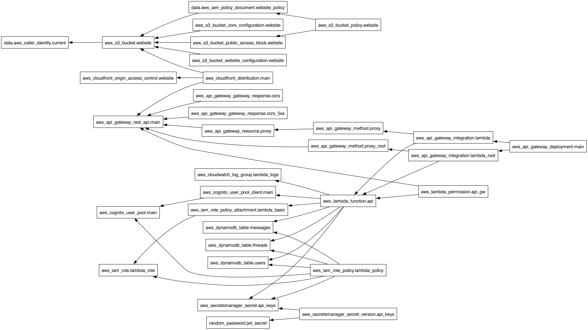
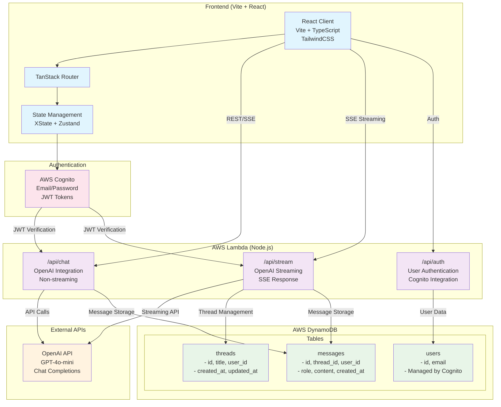

# SeamlessAI - AWS Serverless Deployment

A fully serverless AI chat application built with React and deployed on AWS infrastructure.

## 🏗️ Architecture

```
[브라우저(React)]
   ↕️ https
[CloudFront] ──▶ [S3 정적 호스팅]
   ↕️ https (JWT)
[API Gateway (HTTP API)]
   ↕️ invoke
[Lambda (Node/Fastify)]
   ├─▶ [AI 모델 엔드포인트 (OpenAI/Bedrock)]
   └─▶ [DynamoDB: 대화 로그/세션]
[Secrets Manager/SSM]: API 키, 엔드포인트, 모델 설정
[Cognito]: 로그인(JWT 발급)
[CloudWatch]: 로그/메트릭/알람
```

## Tech Stack

- **Frontend**: React, TypeScript, Vite, TailwindCSS, Zustand, TanStack Query
- **Backend**: AWS Lambda, TypeScript, OpenAI SDK
- **AI Model**: OpenAI GPT-4o-mini (configurable)
- **Database**: DynamoDB (NoSQL)
- **Authentication**: AWS Cognito
- **Infrastructure**: AWS CDK, CloudFormation
- **Deployment**: AWS Lambda, API Gateway, CloudFront, S3

## 🚀 Quick Deployment

### Prerequisites

1. **AWS CLI** - [Install AWS CLI](https://aws.amazon.com/cli/)
2. **Node.js 18+** - [Download Node.js](https://nodejs.org/)
3. **AWS CDK** - Will be installed automatically by the deploy script

### Deploy to AWS

1. **Configure AWS credentials**:

    ```bash
    aws configure
    ```

2. **Clone and deploy**:

    ```bash
    git clone <your-repo>
    cd ai-interface-project
    chmod +x deploy.sh
    ./deploy.sh
    ```

3. **Set your OpenAI API key**:

    ```bash
    # Use the command provided in the deployment output
    aws secretsmanager update-secret --secret-id <ARN> --secret-string '{"OPENAI_API_KEY":"your-key-here","JWT_SECRET":"auto-generated","OPENAI_MODEL":"gpt-4o-mini","OPENAI_MAX_TOKENS":"1000","OPENAI_TEMPERATURE":"0.7"}'
    ```

4. **Access your app** at the CloudFront URL provided in the deployment output.



## 📁 Project Structure

```
ai-interface-project/
├── infrastructure/          # AWS CDK infrastructure code
│   ├── lib/
│   │   └── seamlessai-stack.ts
│   ├── bin/
│   │   └── seamlessai.ts
│   └── package.json
├── packages/
│   ├── lambda/             # AWS Lambda backend
│   │   ├── src/
│   │   │   ├── services/   # Database, Auth, OpenAI services
│   │   │   ├── routes/     # API route handlers
│   │   │   └── index.ts    # Lambda handler
│   │   └── package.json
│   ├── client/             # React frontend
│   │   ├── src/
│   │   └── package.json
│   └── shared/             # Shared types and utilities
└── deploy.sh               # One-click deployment script
```

## Features

- **Real-time AI Chat**: OpenAI GPT integration with streaming responses
- **Thread Management**: Organize conversations in separate threads
- **Multiple Communication Protocols**: REST API, Server-Sent Events (SSE)
- **State Management**: XState for complex state orchestration, Zustand for UI state
- **Authentication**: AWS Cognito with email/password
- **Responsive Design**: Modern UI with Radix UI and TailwindCSS
- **Error Handling**: Comprehensive error boundaries and fallback mechanisms
- **Real-time Updates**: Live message streaming and status updates

## Getting Started

### Prerequisites

- Node.js v16+
- PNPM v7+
- OpenAI API key
- AWS account (for production deployment)

### Environment Setup

1. **Clone and Install Dependencies**

    ```bash
    git clone <repository-url>
    cd ai-interface-project
    pnpm install
    ```

2. **Environment Variables**

    Create `.env` file in project root:

    ```bash
    cp .env.example .env
    ```

    Configure your environment:

    ```env
    # OpenAI Configuration
    OPENAI_API_KEY=sk-your-openai-api-key-here
    OPENAI_MODEL=gpt-4o-mini
    OPENAI_MAX_TOKENS=1000
    OPENAI_TEMPERATURE=0.7

    # AWS Configuration (for production)
    VITE_API_BASE_URL=https://your-api-gateway-url.amazonaws.com/dev
    ```

    > Get your OpenAI API key from [OpenAI Platform](https://platform.openai.com/api-keys) > **중요**: OpenAI API 키는 [STREAMING_STUDY.md](https://github.com/pinkishincoloragain/ai-interface-project/blob/main/STREAMING_STUDY.md)) 최하단을 확인해주세요.

3. **Test OpenAI Connection**

    ```bash
    cd packages/server
    pnpm test:openai
    ```

### Development

#### Local Development (Fastify Server)

```bash
# Run both client and server
pnpm dev

# Run individually
pnpm dev:client  # http://localhost:3000
pnpm dev:server  # http://localhost:3001
```

#### AWS Lambda Development

```bash
# Run client with AWS Lambda backend
VITE_API_BASE_URL=https://your-api-gateway-url.amazonaws.com/dev pnpm dev:client
```

#### Endpoints

- **Frontend**: http://localhost:3000
- **API Server**: http://localhost:3001
- **API Docs**: http://localhost:3001/documentation
- **Supabase Studio**: http://localhost:54323

### Scripts

```bash
# Code Quality
pnpm lint          # Run ESLint
pnpm lint:fix      # Fix linting issues
pnpm format        # Format code with Prettier

# Testing
pnpm test          # Run tests
pnpm test:watch    # Watch mode
pnpm test:coverage # Coverage report

# Building
pnpm build         # Build all packages
pnpm build:client  # Build frontend only
```

### Deployment

#### Docker

```bash
# Production build and run
docker-compose up --build

# Development environment
docker-compose up --build dev
```

#### AWS Terraform

```bash
# Automated deployment
./deploy-terraform.sh

# Manual deployment
cd terraform
terraform init
terraform apply
```

## API Reference

### Chat Endpoints

- **POST** `/api/chat` - Send chat message
- **POST** `/api/chat/sse` - Streaming chat with SSE
- **GET** `/api/threads` - List conversation threads
- **GET** `/api/threads/:id` - Get specific thread
- **POST** `/api/threads` - Create new thread

### AWS Lambda Functions

- `/api/chat` - Chat completion
- `/api/stream` - Streaming responses
- `/api/auth` - Authentication

### Health Checks

- **GET** `/api/test/openai` - Test OpenAI connection
- **GET** `/api/test/health` - Server health check

### Environment Variables

| Variable             | Description                   | Default       | Required |
| -------------------- | ----------------------------- | ------------- | -------- |
| `OPENAI_API_KEY`     | OpenAI API key                | -             | Yes      |
| `OPENAI_MODEL`       | OpenAI model to use           | `gpt-4o-mini` | No       |
| `OPENAI_MAX_TOKENS`  | Max completion tokens         | `1000`        | No       |
| `OPENAI_TEMPERATURE` | Response creativity (0.0-2.0) | `0.7`         | No       |
| `VITE_API_BASE_URL`  | AWS API Gateway URL           | -             | Yes\*    |

\*Required for AWS deployment

## Infrastructure Architecture



## Architecture

This project follows **Feature-Sliced Design (FSD)** principles:

```
src/
├── app/          # Application layer (providers, router)
├── pages/        # Pages layer (route components)
├── features/     # Feature layer (business logic)
│   ├── chat/     # Chat functionality
│   ├── thread/   # Thread management
│   └── auth/     # Authentication
├── entities/     # Entities layer (data models)
├── shared/       # Shared layer (UI components, utils)
└── widgets/      # Widgets layer (complex UI blocks)
```

### State Management

- **XState**: Complex state machines for chat flow
- **Zustand**: Simple UI state management
- **TanStack Query**: Server state management

### Key Features

- **Real-time Streaming**: SSE-based message streaming
- **Thread Management**: Organized conversation handling
- **Error Boundaries**: Comprehensive error handling
- **Responsive Design**: Mobile-first approach
- **Performance**: Optimized rendering and caching

### Development Guidelines

#### Adding New Components

Follow FSD structure:

```
features/chat/ui/MessageInput/
├── index.tsx              # Component implementation
├── MessageInput.test.tsx  # Tests
└── MessageInput.stories.tsx # Storybook stories
```

#### OpenAI Model Configuration

```env
# Available models
OPENAI_MODEL=gpt-4o-mini    # Default (fast & cost-effective)
OPENAI_MODEL=gpt-3.5-turbo  # Fast responses
OPENAI_MODEL=gpt-4          # High quality
OPENAI_MODEL=gpt-4-turbo    # Extended context
```

## Troubleshooting

### Common Issues

1. **OpenAI API Key Errors**

    - Verify `.env` file exists in project root
    - Check API key starts with `sk-`
    - Ensure sufficient credits in OpenAI account
    - Run: `cd packages/server && pnpm test:openai`

2. **Server Startup Errors**

    - Verify Node.js v16+
    - Run `pnpm install` to install dependencies
    - Test OpenAI setup: `pnpm test:openai`

3. **Supabase Deployment Issues**

    - Check project ID and access token
    - Verify Edge Function secrets are set
    - Review Edge Function logs in Supabase Dashboard

4. **CORS Errors**
    - Check CORS configuration in server settings
    - Verify allowed origins match your domain

### Debug Endpoints

- **OpenAI Test**: `http://localhost:3001/api/test/openai`
- **Health Check**: `http://localhost:3001/api/test/health`
- **Supabase Studio**: `http://localhost:54323`

## Contributing

1. Follow Feature-Sliced Design principles
2. Add JSDoc comments for components and functions
3. Write tests for new features
4. Update documentation for API changes
5. Follow existing code style and conventions

## License

This project is licensed under the MIT License.
