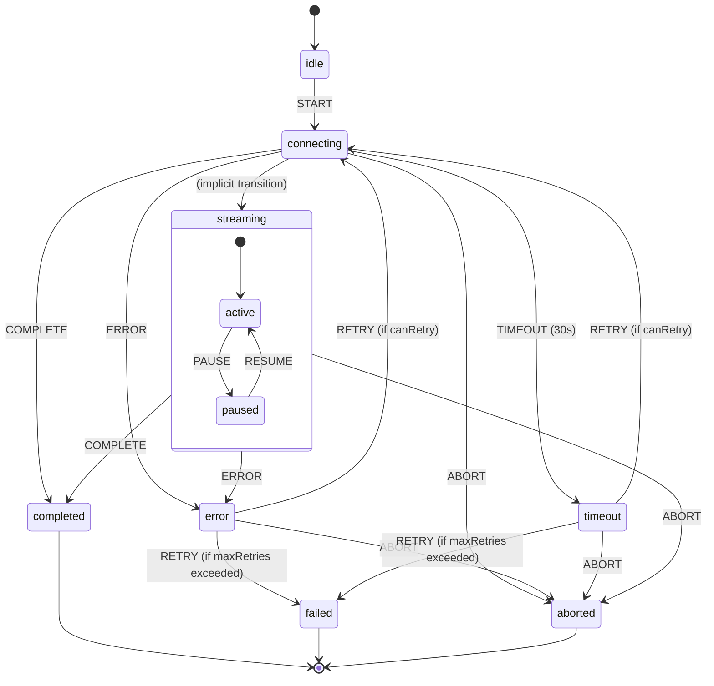

# XState Management Documentation

## Overview

This project uses XState for managing complex state machines, particularly for streaming operations. XState provides predictable state management with explicit state transitions, making it easier to handle complex async operations like Server-Sent Events (SSE).

## Simple Streaming Machine

### Architecture

The `simpleStreamingMachine` is located at:

```
packages/client/src/shared/lib/streaming/simpleStreamingMachine.ts
```

### Visualization

To visualize this state machine:

1. Open [https://stately.ai/viz](https://stately.ai/viz)
2. Copy the machine configuration from `visualization/simpleStreamingMachine.viz.ts`
3. Paste it into the visualizer

### State Machine Structure

#### Context

```typescript
interface SimpleStreamingContext {
    url?: string; // SSE endpoint URL
    headers?: Record<string, string>; // Request headers
    timeout: number; // Connection timeout (default: 30s)
    maxRetries: number; // Maximum retry attempts (default: 3)
    currentRetries: number; // Current retry count
    messageId?: string; // Message identifier
    conversationId?: string; // Conversation identifier
    error?: Error; // Last error encountered
}
```

#### Events

```typescript
type SimpleStreamingEvent =
    | { type: 'START'; url: string; headers?: Record<string, string>; messageId?: string }
    | { type: 'COMPLETE' }
    | { type: 'ERROR'; error: Error }
    | { type: 'TIMEOUT' }
    | { type: 'RETRY' }
    | { type: 'ABORT' }
    | { type: 'PAUSE' }
    | { type: 'RESUME' };
```

#### States



### State Descriptions

| State              | Description                                  | Entry Actions         | Exit Actions |
| ------------------ | -------------------------------------------- | --------------------- | ------------ |
| `idle`             | Initial state, waiting for START event       | None                  | None         |
| `connecting`       | Establishing SSE connection                  | `initializeStreaming` | None         |
| `streaming`        | Actively receiving data                      | None                  | None         |
| `streaming.active` | Processing incoming stream data              | None                  | None         |
| `streaming.paused` | Stream paused by user                        | None                  | None         |
| `completed`        | Stream finished successfully (final)         | None                  | None         |
| `error`            | Error occurred, retry possible               | `setError`            | None         |
| `timeout`          | Connection timed out                         | `setTimeoutError`     | None         |
| `failed`           | Permanently failed after max retries (final) | None                  | None         |
| `aborted`          | User aborted operation (final)               | None                  | None         |

### Actions

| Action                | Purpose                                     | Implementation                         |
| --------------------- | ------------------------------------------- | -------------------------------------- |
| `initializeStreaming` | Set up context with URL, headers, messageId | Assigns START event data to context    |
| `setError`            | Store error in context                      | Assigns error from ERROR event         |
| `setTimeoutError`     | Create timeout error                        | Creates new Error with timeout message |
| `incrementRetry`      | Increase retry counter                      | Increments currentRetries              |
| `clearError`          | Remove error from context                   | Sets error to undefined                |

### Guards

| Guard      | Purpose                   | Condition                     |
| ---------- | ------------------------- | ----------------------------- |
| `canRetry` | Check if retry is allowed | `currentRetries < maxRetries` |

### Usage Example

```typescript
import { createActor } from 'xstate';
import { simpleStreamingMachine } from './path/to/simpleStreamingMachine';

// Create machine actor
const streamingActor = createActor(simpleStreamingMachine);

// Subscribe to state changes
streamingActor.subscribe((state) => {
    console.log('Current state:', state.value);
    console.log('Context:', state.context);
});

// Start the machine
streamingActor.start();

// Send events
streamingActor.send({
    type: 'START',
    url: '/api/stream',
    headers: { Authorization: 'Bearer token' },
    messageId: 'msg-123',
});

// Handle completion
streamingActor.send({ type: 'COMPLETE' });

// Handle errors with retry
streamingActor.send({
    type: 'ERROR',
    error: new Error('Connection failed'),
});
streamingActor.send({ type: 'RETRY' });

// User controls
streamingActor.send({ type: 'PAUSE' });
streamingActor.send({ type: 'RESUME' });
streamingActor.send({ type: 'ABORT' });
```

### Best Practices

1. **Error Handling**: Always provide meaningful error objects with descriptive messages
2. **Retry Logic**: Set appropriate `maxRetries` and `timeout` values based on your use case
3. **State Monitoring**: Subscribe to state changes to update UI accordingly
4. **Resource Cleanup**: Handle `aborted` and `failed` final states to clean up resources

### Integration with React

```typescript
import { useActor } from '@xstate/react';

function StreamingComponent() {
    const [state, send] = useActor(streamingActor);

    const handleStart = () => {
        send({
            type: 'START',
            url: '/api/stream',
            messageId: generateId()
        });
    };

    const handlePause = () => send({ type: 'PAUSE' });
    const handleResume = () => send({ type: 'RESUME' });
    const handleAbort = () => send({ type: 'ABORT' });

    return (
        <div>
            <div>Status: {state.value}</div>
            {state.context.error && (
                <div>Error: {state.context.error.message}</div>
            )}
            <div>Retries: {state.context.currentRetries}/{state.context.maxRetries}</div>

            {state.matches('idle') && (
                <button onClick={handleStart}>Start Stream</button>
            )}

            {state.matches('streaming.active') && (
                <button onClick={handlePause}>Pause</button>
            )}

            {state.matches('streaming.paused') && (
                <button onClick={handleResume}>Resume</button>
            )}

            {(state.matches('streaming') || state.matches('connecting')) && (
                <button onClick={handleAbort}>Abort</button>
            )}

            {(state.matches('error') || state.matches('timeout')) && (
                <button onClick={() => send({ type: 'RETRY' })}>Retry</button>
            )}
        </div>
    );
}
```

### Testing

```typescript
import { createActor } from 'xstate';
import { simpleStreamingMachine } from './simpleStreamingMachine';

describe('SimpleStreamingMachine', () => {
    it('should start in idle state', () => {
        const actor = createActor(simpleStreamingMachine);
        actor.start();
        expect(actor.getSnapshot().value).toBe('idle');
    });

    it('should transition to connecting on START', () => {
        const actor = createActor(simpleStreamingMachine);
        actor.start();

        actor.send({
            type: 'START',
            url: '/test',
            messageId: 'test-123',
        });

        expect(actor.getSnapshot().value).toBe('connecting');
        expect(actor.getSnapshot().context.url).toBe('/test');
        expect(actor.getSnapshot().context.messageId).toBe('test-123');
    });

    it('should retry up to maxRetries', () => {
        const actor = createActor(simpleStreamingMachine);
        actor.start();

        // Start and get error
        actor.send({ type: 'START', url: '/test' });
        actor.send({ type: 'ERROR', error: new Error('Test error') });

        // Retry 3 times
        for (let i = 1; i <= 3; i++) {
            actor.send({ type: 'RETRY' });
            expect(actor.getSnapshot().context.currentRetries).toBe(i);
            actor.send({ type: 'ERROR', error: new Error('Test error') });
        }

        // 4th retry should go to failed
        actor.send({ type: 'RETRY' });
        expect(actor.getSnapshot().value).toBe('failed');
    });
});
```

## Future Enhancements

1. **Progress Tracking**: Add progress context for long-running streams
2. **Metrics Collection**: Add timing and performance metrics
3. **Custom Retry Strategies**: Exponential backoff, jitter
4. **Connection Pooling**: Multiple concurrent streams
5. **Partial Recovery**: Resume from specific positions
