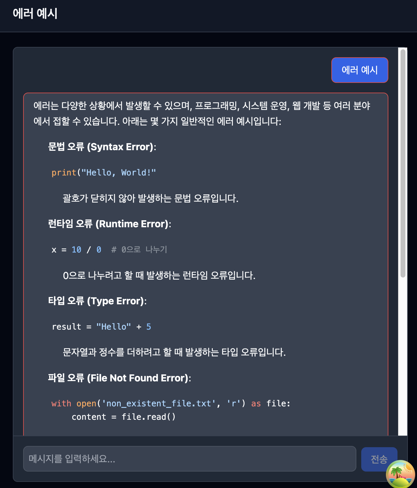
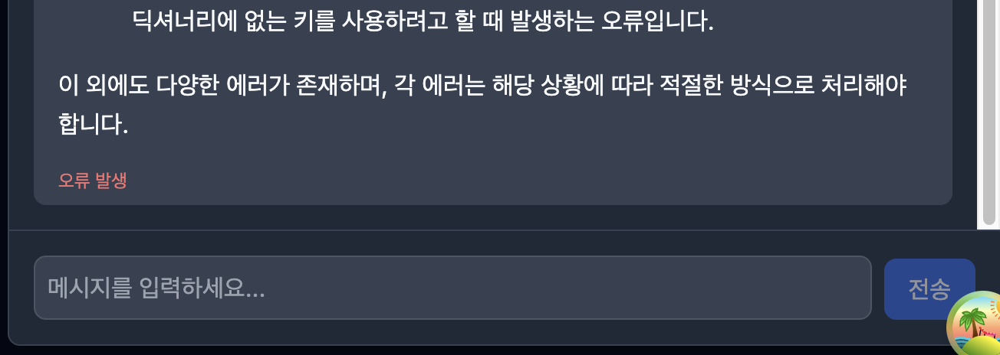

# 스트리밍 시스템 분석 보고서

## 1. 코드 플로우 분석

### useSendMessageMutation 실행 과정 단계별 설명

1. Tanstack Query의 useMutation hook을 통해 `sendMessageMutation`(사용처 변수명) 객체를 return
2. Zustand store를 통해 클라이언트 상태 관리
3. mutationFn은 사용자 입력 input value(`content`)와 대화 중인 쓰레드인 threadId를 인자로 받음
4. 현재 쓰레드의 메시지들(`currentMessages`)에 방금 입력한 사용자 메시지 객체를(`userMessage`)를 추가하고, API 요청(`chatApi.sendMessage`)
5. 어시스턴트 매시지 객체(`assistantPlaceholder`) 생성
6. 스트림을 처리하는 쓰레드 id를 return하는 `streamingHandler` 인스턴스 생성
7. catch block에선 에러 발생 시 현재 store에서 어시스턴트 메시지 목록 중 완료되지 않은 메시지를 찾고, error 상태로 업데이트
8. onSuccess에서 쓰레드 목록과 메시지 목록 query를 invalidate, onError 에러 처리

### SSEStreamingHandler 생명주기 분석

- 스트리밍 데이터를 안정적으로 수신하고 처리하는 클래스
- 생성 → 연결 및 처리 시작 → 데이터 수신 및 파싱 → 종료 및 정리
- options 매개변수(messageId, currentThreadId, timeout, onEvent, onError, onComplete)
- 스트림 reader, text decoder, 데이터 buffer, isComplete, timeoutId 초기화

1. `handleStream`: 타이머 작동(`setupTimeout`), 스트림 데이터 처리(`processStreamChunks`)
2. `setupTimeout`: 스트림이 완료되기 전에 타이머가 실행
3. `processStreamChunks`: 데이터 청크를 비동기적으로 읽어 여러 라인으로 만들고, 각 라인에 대해 `processSSELine()`을 호출(done, error, 그외)
4. `processSSELine`: `data: `로 시작하는 라인은 JSON.parse로 파싱하여 `onEvent` callback으로 전달
5. `handleComplete`: 완료 처리
6. `handleError`: 에러 처리
7. `cleanup`: 리소스 정리(타이머 제거, reader 해제, buffer 초기화)
8. `cancel`: 스트림 취소(`cleanup`)

### Zustand store 상태 변화 추적

1. `setMessages`: 대화 쓰레드 선택했을 때 메시지 설정 `{ threadId: {...} }`
2. `addMessage`: 사용자 메시지, 어시스턴트 메시지 추가
3. `updateMessage`: 메시지 id를 입력받아 메시지 상태 업데이트
4. `removeMessage`: 메시지 id를 입력받아 메시지 삭제
5. `setCurrentThreadId`: 현재 활성화된 쓰레드 id 설정
6. `setLoading`: 로딩 상태 설정
7. `clearMessages`: 메시지 목록 초기화

## 2. 데이터 구조 분석

### SSEMessageData 인터페이스 필드별 설명

- `id`: 어시스턴트 메시지 id
- `content`: 어시스턴트가 생성한 데이터 청크
- `role`: 'assistant'
- `conversationId`: 쓰레드 id
- `isDone`: 메시지 완료 여부

- response 예시

```json
{
    "id": "0827a605-c658-46c0-be91-d8df8e559294",
    "content": "안녕하세요! 저는 입력된 텍스트를 분석하고 이해하는 데 도움을 줄 수 있는 인공지능입니다. 여러분이 질문하거나 요청하는 내용을 바탕으로 적절한 정보를 제공하거나 대화할",
    "role": "assistant",
    "conversationId": "a4570d62-befd-45ad-9f98-ebfffc20e1c9",
    "isDone": false
}

{
    "id": "0827a605-c658-46c0-be91-d8df8e559294",
    "content": "안녕하세요! 저는 입력된 텍스트를 분석하고 이해하는 데 도움을 줄 수 있는 인공지능입니다. 여러분이 질문하거나 요청하는 내용을 바탕으로 적절한 정보를 제공하거나 대화할 수",
    "role": "assistant",
    "conversationId": "a4570d62-befd-45ad-9f98-ebfffc20e1c9",
    "isDone": false
}

{
    "id": "0827a605-c658-46c0-be91-d8df8e559294",
    "content": "안녕하세요! 저는 입력된 텍스트를 분석하고 이해하는 데 도움을 줄 수 있는 인공지능입니다. 여러분이 질문하거나 요청하는 내용을 바탕으로 적절한 정보를 제공하거나 대화할 수 있습니다",
    "role": "assistant",
    "conversationId": "a4570d62-befd-45ad-9f98-ebfffc20e1c9",
    "isDone": false
}
```

### StreamingEvent 타입들의 용도와 발생 조건

- `message`: `SSEStreamingHandler`가 서버로부터 data: {...} 형태의 데이터 라인을 수신하고, 그 내용을 성공적으로 JSON 객체로 파싱했을 때 발생
- `error`: `SSEStreamingHandler`가 서버로부터 event: error 라는 내용의 라인을 직접 수신했을 때 발생
- `done`: SSEStreamingHandler가 서버로부터 스트림의 끝을 의미하는 data: [DONE] 라인을 수신했을 때 발생
- `timeout`: `SSEStreamingHandler`를 생성할 때 설정한 timeout 시간(기본 30초)이 경과할 때까지 스트리밍이 완료되지 않고 아무런 신호가 없을 경우 발생

### ChatMessage 상태(sending, success, error) 전환 조건

- `sending`
    - 어시스턴트 메시지를 최초 생성할 때
    - 어시스턴트 메시지 데이터의 `content` 필드가 있고, `isDone` 필드가 false일 때
- `success`
    - 사용자 메시지를 최초 생성할 때
    - 어시스턴트 메시지의 `content` 필드가 있고, `isDone` 필드가 true일 때,
    - `onComplete` option에서 스트림 완료 처리를 했을 때
- `error`
    - timeout이 났을 때
    - `onError` option에서 스트림 에러 처리를 했을 때

## 3. 에러 케이스 분석

### 현재 처리되는 에러 유형들

- 메시지 전송 실패 (HTTP 요청 실패): `chatApi.sendMessage`
- 스트리밍 중 에러 발생: `createStreamingHandler`의 timeout, `onError` option

### 각 에러에 대한 사용자 피드백 방식

- console.error
- 말풍선 메시지 테두리 변경: `border border-red-500`
    - 
- 에러 텍스트 표시
    - 

### 개선이 필요한 에러 시나리오들

- 에러 원인 구체화
    - AS-IS: 모든 에러가 메시지 단위에 '오류 발생'으로만 표시
    - TO-BE: "네트워크 연결이 끊겼습니다.", "서버 응답이 없습니다." 등 원인에 따라 구체적인 에러 메시지를 사용자에게 보여줌
- 오프라인 상태 지원
    - AS-IS: 네트워크 연결이 끊긴 상태에서 메시지를 보내면 바로 전송 실패
    - TO-BE: 메시지를 임시로 저장해두었다가, 네트워크 연결이 복구되었을 때 자동으로 전송
